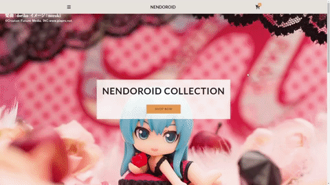

# Nendoroid

## Disclaimer:

## Links
- Live Site URL: [Nendoroid](https://mikowesome.github.io/nendoroid/)

## Project Screenshot

## Project Description

## Functions Covered

- ES6 classes
- static functions
- querySelector()
- async
- fetch()
- await
- addEventListener
- classList(add, remove, contains)
- forEach()
- Array.map()
- Array.find()
- localStorage(setItem, getItem)
- JSON(stringify, parse)

